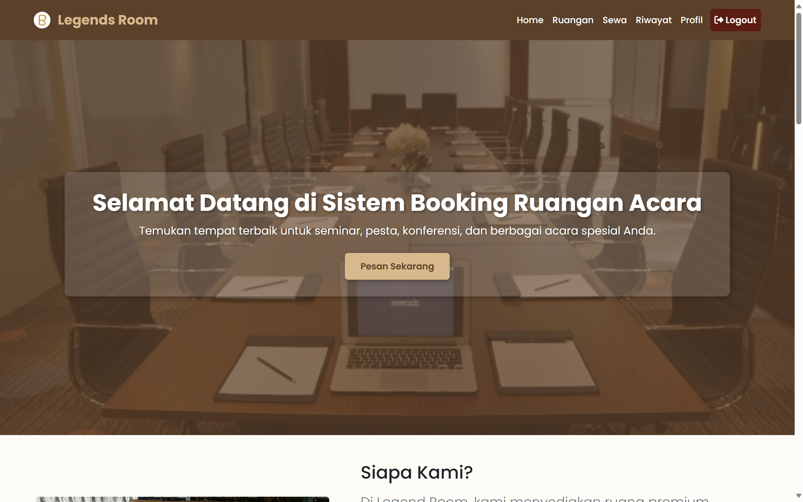
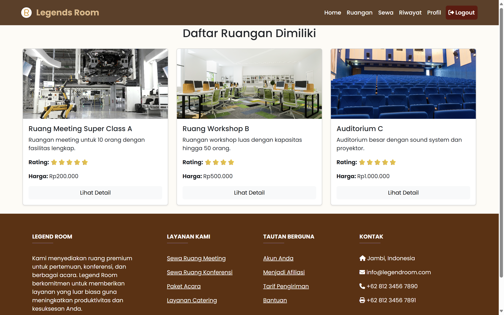
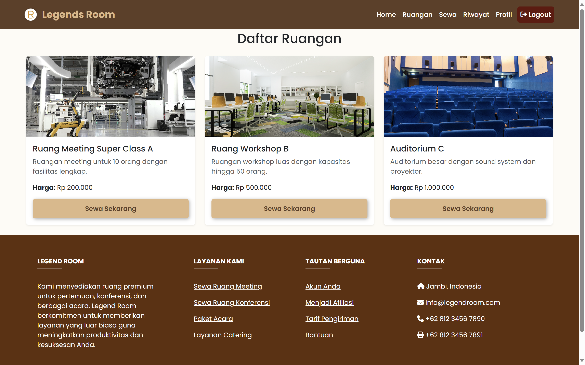
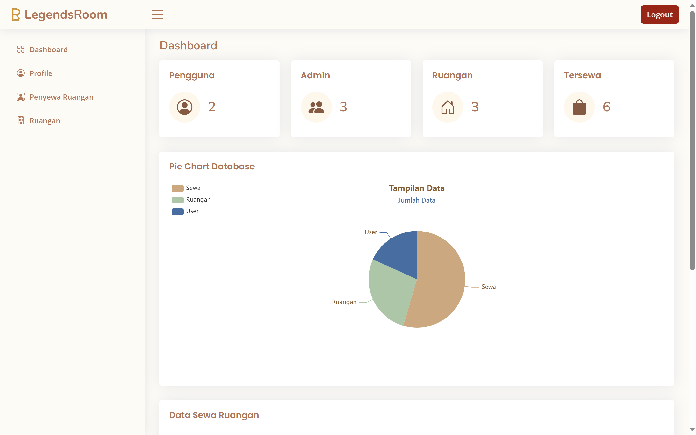

# 🏛️ Legends Room – Aplikasi Penyewaan Ruangan

Legends Room adalah aplikasi berbasis Laravel untuk mengelola penyewaan ruangan secara online. Pengguna dapat melihat daftar ruangan, melakukan booking, dan memantau status penyewaan secara mudah dan cepat.



## 🎯 Fitur Utama

- 🏠 Lihat daftar ruangan lengkap dengan foto & deskripsi
- 📆 Booking ruangan dengan jadwal fleksibel
- 🧾 Riwayat penyewaan per pengguna
- 🧑‍💼 Panel admin untuk kelola ruangan, pesanan, dan pengguna
- 📸 Upload gambar ruangan dengan preview
- 📤 Email notifikasi (jika diaktifkan)

## 📸 Tampilan Aplikasi

### 🔍 Halaman Daftar Ruangan


### 📝 Halaman Booking


### 🧑‍💼 Admin – Panel Admin


## ⚙️ Teknologi yang Digunakan

| Komponen       | Teknologi        |
|----------------|------------------|
| Backend        | Laravel 12       |
| Frontend       | Blade + Bootstrap 5 |
| Database       | MySQL            |
| File Upload    | Laravel Storage  |
| Autentikasi    | Laravel Auth     |

## 🚀 Cara Menjalankan (Local)

### 1. Clone Repository
```bash
git clone https://github.com/azizhadiid/laravel-legends-project.git
cd legends-room
```

### 2. Instal Dependensi Laravel
```bash
composer install
```

### 3. Konfigurasi Environment
```bash
cp .env.example .env
php artisan key:generate
```

### 4. Edit file .env untuk konfigurasi database
```bash
DB_DATABASE=legends_room
DB_USERNAME=root
DB_PASSWORD=
```

### 5.Migrasi Database dan Run
``` bash
php artisan migrate 
php artisan serve

Buka di browser: http://localhost:8000
```

## 📁 Struktur Folder
``` bash
legends-room/
├── app/
├── public/
│   └── assets/
├── resources/
│   └── views/
├── routes/
│   └── web.php
└── .env
```

## 🙌 Kontribusi
Jika kamu tertarik untuk berkontribusi, silakan buat issue atau pull request. Semua masukan sangat dihargai.

## 📬 Kontak
📧 Email: azizalhadiid88@gmail.com
